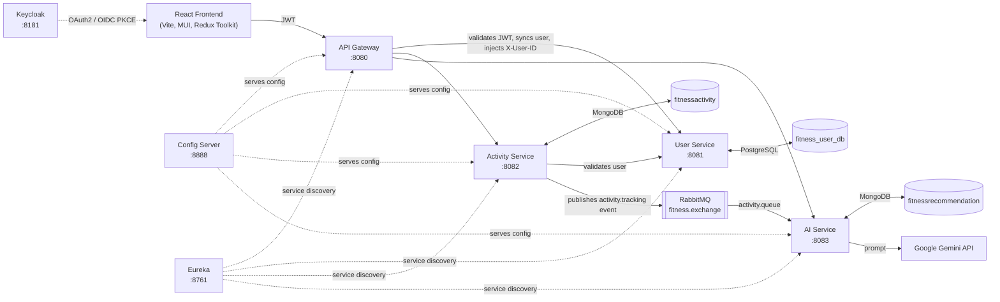

# AI-Powered Fitness Application

A microservices-based fitness tracking platform where users log workout activities and receive AI-generated feedback and recommendations, powered by Google's Gemini API. Built with Spring Boot, Spring Cloud, and a React frontend, with Keycloak handling authentication.

## Overview

Users authenticate through Keycloak and log activities (running, cycling, yoga, etc.) from the React frontend. Each activity is persisted and published to a message queue; a dedicated AI service consumes those events, sends the activity data to Gemini, and stores back a personalized recommendation (analysis, suggestions, safety tips, and target metrics) that the user can view alongside their activity history.

## Architecture

The system is composed of six Spring Boot services plus a React frontend, coordinated through Eureka service discovery and a centralized Config Server:



**Flow:** a user signs in via Keycloak (Authorization Code + PKCE) → the gateway validates the resulting JWT on every request, transparently registers first-time users in the User Service, and forwards requests with an `X-User-ID` header → the Activity Service validates the user, stores the activity in MongoDB, and publishes an event to RabbitMQ → the AI Service consumes the event, builds a prompt from the activity data, calls Gemini, and stores the generated recommendation → the frontend fetches recommendations per activity or per user.

## Services

| Service | Port | Responsibility | Datastore |
|---|---|---|---|
| `eureka` | 8761 | Service discovery (Netflix Eureka server) | — |
| `configserver` | 8888 | Centralized configuration for all services (native profile, config files in `configserver/src/main/resources/config`) | — |
| `gateway` | 8080 | Single entry point; routes `/api/**` to downstream services, validates JWTs as an OAuth2 resource server, syncs Keycloak users into User Service on first request, handles CORS | — |
| `userservice` | 8081 | User registration and profile lookup | PostgreSQL (`fitness_user_db`) |
| `activityservice` | 8082 | Records workout activities, validates the user via the User Service, publishes activity events to RabbitMQ | MongoDB (`fitnessactivity`) |
| `aiservice` | 8083 | Consumes activity events, calls Gemini to generate a recommendation, exposes recommendations by user/activity | MongoDB (`fitnessrecommendation`) |
| `fitness-app-frontend` | 5173 (dev) | React SPA — activity logging, activity list/detail views, Keycloak login | — |

**External infrastructure required:** PostgreSQL, MongoDB, RabbitMQ, and a Keycloak realm (see [Configuration](#configuration) below).

## Tech Stack

**Backend**
- Java 23 (Java 17 for `eureka` and `configserver`), Spring Boot 3.4.3, Spring Cloud 2024.0.0
- Spring Cloud Gateway, Netflix Eureka, Spring Cloud Config (native)
- Spring Data JPA (PostgreSQL), Spring Data MongoDB
- Spring AMQP (RabbitMQ) for event-driven activity → recommendation processing
- Spring Security OAuth2 Resource Server (JWT) with Keycloak
- Spring WebFlux / WebClient for reactive and inter-service HTTP calls
- Lombok, Maven

**Frontend**
- React 19 + Vite
- MUI (Material UI) + Emotion
- Redux Toolkit / React Redux
- `react-oauth2-code-pkce` for Keycloak login (Authorization Code + PKCE)
- Axios, React Router

**AI**
- Google Gemini API (called from `aiservice` via `GeminiService`)

## Prerequisites

- JDK 23 (JDK 17 is sufficient for `eureka` and `configserver` alone)
- Maven (or use the included `mvnw` wrapper in each service)
- Node.js + npm
- PostgreSQL running locally
- MongoDB running locally
- RabbitMQ running locally
- A Keycloak instance with a realm named `fitness-oauth2` and a public client `oauth2-pkce-client` configured for Authorization Code + PKCE, redirect URI `http://localhost:5173`
- A Google Gemini API key

## Getting Started

Clone the repository:

```bash
git clone https://github.com/akshatrajshanu1809-create/AI-POWERED-FITNESS-APPLICATION.git
cd AI-POWERED-FITNESS-APPLICATION
```

Make sure PostgreSQL, MongoDB, RabbitMQ, and Keycloak are running locally with the defaults described in [Configuration](#configuration) (or update the config files to match your setup).

Set the Gemini API environment variables before starting `aiservice` (see below), then start the services **in this order**, each in its own terminal:

```bash
# 1. Config Server — must be up first, other services fetch their config from it
cd configserver && ./mvnw spring-boot:run

# 2. Eureka — service discovery
cd eureka && ./mvnw spring-boot:run

# 3. Core services (any order, once Config Server + Eureka are up)
cd userservice && ./mvnw spring-boot:run
cd activityservice && ./mvnw spring-boot:run
cd aiservice && ./mvnw spring-boot:run

# 4. Gateway — routes to the services above
cd gateway && ./mvnw spring-boot:run

# 5. Frontend
cd fitness-app-frontend
npm install
npm run dev
```

The frontend will be available at `http://localhost:5173`, and all API calls should go through the gateway at `http://localhost:8080`.

## Configuration

Service configuration is centralized in `configserver/src/main/resources/config/*.yml`. Key values to set for your environment:

**`aiservice` — Gemini API** (environment variables, not committed):
```bash
export GEMINI_API_URL="https://generativelanguage.googleapis.com/v1beta/models/gemini-pro:generateContent?key="
export GEMINI_API_KEY="your-gemini-api-key"
```

**`userservice` — PostgreSQL** (`configserver/.../config/user-service.yml`):
```yaml
spring:
  datasource:
    url: jdbc:postgresql://localhost:5432/fitness_user_db
    username: postgres
    password: your-postgres-password
```

**`activityservice` / `aiservice` — MongoDB and RabbitMQ:** default to `mongodb://localhost:27017` and `localhost:5672` (guest/guest) — update as needed.

**`gateway` — Keycloak:**
```yaml
spring:
  security:
    oauth2:
      resourceserver:
        jwt:
          jwk-set-uri: http://localhost:8181/realms/fitness-oauth2/protocol/openid-connect/certs
```

**`fitness-app-frontend` — Keycloak client** (`src/authConfig.js`): client ID `oauth2-pkce-client`, realm `fitness-oauth2`, redirect URI `http://localhost:5173`.

> Note: credentials in the sample config files are for local development only — replace them and avoid committing real secrets before deploying.

## API Reference

All requests go through the gateway at `http://localhost:8080` and require a valid Keycloak-issued bearer token.

**User Service** — `/api/users`
| Method | Path | Description |
|---|---|---|
| POST | `/api/users/register` | Register a new user |
| GET | `/api/users/{userId}` | Get a user's profile |
| GET | `/api/users/{userId}/validate` | Check whether a user exists |

**Activity Service** — `/api/activities`
| Method | Path | Description |
|---|---|---|
| POST | `/api/activities` | Log a new activity (`X-User-ID` header set automatically by the gateway) |
| GET | `/api/activities` | List the current user's activities |
| GET | `/api/activities/{activityId}` | Get a single activity |

Supported activity types: `RUNNING`, `WALKING`, `CYCLING`, `SWIMMING`, `WEIGHT_TRAINING`, `YOGA`, `HIIT`, `CARDIO`, `STRETCHING`, `OTHER`.

**AI Service** — `/api/recommendations`
| Method | Path | Description |
|---|---|---|
| GET | `/api/recommendations/user/{userId}` | Get all recommendations for a user |
| GET | `/api/recommendations/activity/{activityId}` | Get the recommendation generated for a specific activity |

## Project Structure

```
AI-POWERED-FITNESS-APPLICATION/
├── eureka/                  # Service discovery server
├── configserver/            # Centralized config (native profile)
│   └── src/main/resources/config/   # Per-service YAML config
├── gateway/                 # API Gateway, JWT validation, Keycloak user sync
├── userservice/             # User registration & profiles (PostgreSQL)
├── activityservice/         # Activity tracking (MongoDB, RabbitMQ producer)
├── aiservice/                # AI recommendations (MongoDB, RabbitMQ consumer, Gemini client)
└── fitness-app-frontend/    # React + Vite SPA
```

## Roadmap / Ideas

- Containerize services with Docker Compose for one-command local startup
- Add automated tests and CI
- Add a license

## Contributing

Issues and pull requests are welcome.
